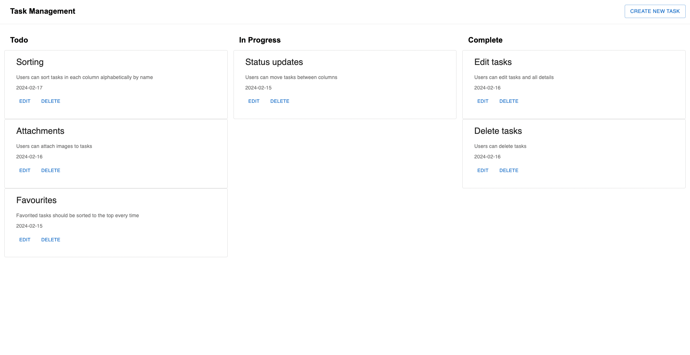
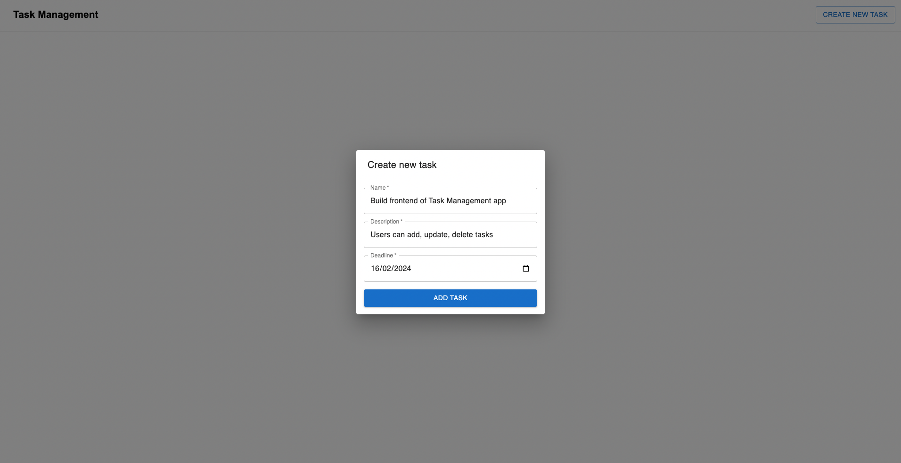
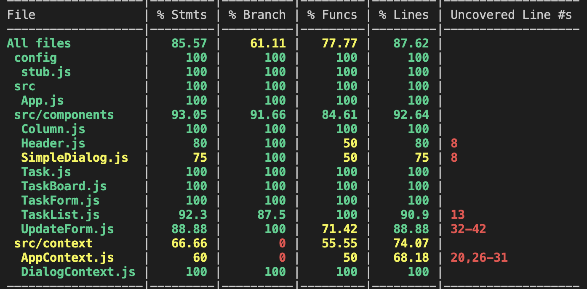

### How to setup ?
1. git clone `https://github.com/aadeshkulkarni/task-management`
2. cd task-management/
3. yarn add
4. yarn start

### Done
- Users can add new tasks to the task board
- Details include name, description, deadline
- Users can edit tasks and all details
- Users can delete tasks
- Users can move tasks between columns
- Users can add columns to the task board representing different work states (ie. ToDo, In Progress &amp; Done)
- Users can drill into tasks to see all details

### Pending:
- Users can sort tasks in each column alphabetically by name
- Users can attach images to tasks
- Favorited tasks should be sorted to the top every time

### Screenshots

